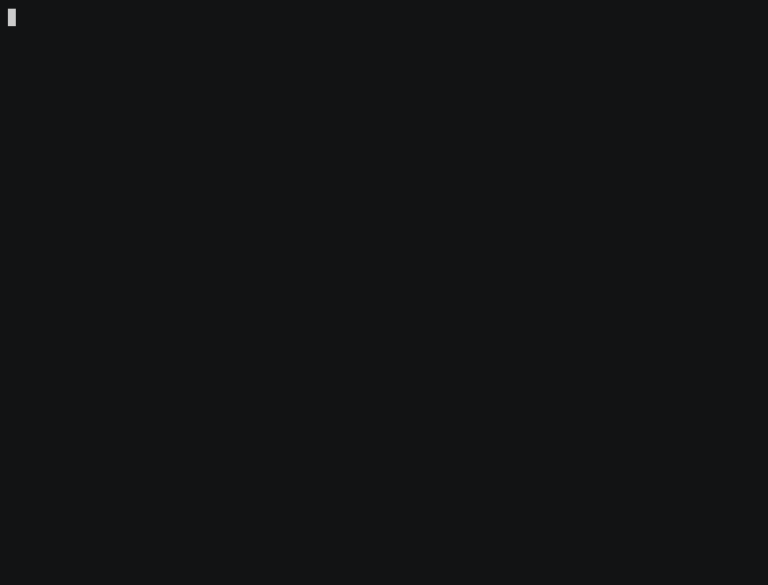

<h1 align="center">
  <a href="https://dynobox.xyz">
    
  </a>
</h1>

<p align="center">
  <a href="https://www.npmjs.com/package/dynobox"></a>
  <a href="https://github.com/dynobox/dynobox/actions/workflows/ci.yml"></a>
  <a href="./LICENSE"></a>
  <a href="https://nodejs.org/"></a>
</p>

## Deterministic agent verification.

Open-source test runner for coding agents and skills: run real workflows,
capture evidence, assert on tools, commands, files, and answers.

<p align="center">
  <a href="https://docs.dynobox.xyz/getting-started">Get started</a> ·
  <a href="https://docs.dynobox.xyz/how-it-works">How it works</a> ·
  <a href="https://docs.dynobox.xyz">Documentation</a> ·
  <a href="https://dash.dynobox.xyz">Dashboard</a> ·
  <a href="https://www.skills.sh/dynobox/skills">Agent skills</a> ·
  <a href="https://github.com/dynobox/examples">Examples</a>
</p>

<p align="center">
  
</p>

---

- Assert on tool calls, commands, files, HTTP requests, transcripts, and final
  answers without requiring one model to judge another.
- Run the same scenario through Claude Code, OpenAI Codex, and OpenCode (with
  more to come) to find behavior that varies between environments.
- Test multi-step tasks in fresh temporary work directories, repeat them to
  expose flaky behavior, and keep the evidence when something fails.
- Replace bare executable calls with scenario-scoped static, sequential, or
  handler responses using [experimental CLI mocks](https://docs.dynobox.xyz/config-authoring/#cli-mocks).

## Requirements

Node.js 22+ and at least one supported harness (Claude Code, Codex, or OpenCode)
installed, authenticated, and available on `PATH`.

## Quick start

```bash
npx dynobox init                         # Claude Code (default)
npx dynobox init --harness codex         # OpenAI Codex
npx dynobox init --harness opencode      # OpenCode
npx dynobox run
```

Run one `init` command for a harness that is installed and authenticated, then
run the generated dyno.

`dynobox init` creates a starter dyno in `dynobox/example.dyno.mjs`.
`dynobox run` discovers `*.dyno.{mjs,js,ts,mts,yaml,yml}` files below the current
directory and runs their scenarios against the configured harnesses.

Only run dynos you trust. JavaScript and TypeScript configs are imported, and
setup and verification commands execute on your machine. Temporary work
directories separate job files, but they are not security sandboxes; processes
can access the host according to their permissions.

## Writing a dyno

A dyno combines the prompt, fixture setup, harnesses, and acceptance criteria in
one TypeScript, JavaScript, or YAML file:

```yaml
# package.dyno.yaml
name: package-script
harnesses:
  - claude-code
  - codex
  - opencode
scenarios:
  - name: detects the test script
    setup:
      - |
        cat > package.json <<'JSON'
        {"scripts":{"test":"vitest run"}}
        JSON
    prompt: >-
      Use cat package.json and tell me whether this project has a test script.
    assertions:
      - type: command.called
        executable: cat
        command: {args: [package.json]}
      - type: tool.notCalled
        tool: edit_file
      - type: artifact.contains
        path: package.json
        text: vitest run
      - type: finalMessage.contains
        text: test
```

Run the test:

```bash
npx dynobox run package.dyno.yaml
```

The same shape works in TypeScript and JavaScript via
[`@dynobox/sdk`](https://www.npmjs.com/package/@dynobox/sdk)
(`defineDyno`, `tool`, `command`, ...). See
[Config Authoring](https://docs.dynobox.xyz/config-authoring).

Dynobox launches the selected harnesses in fresh temporary work directories,
records the observable behavior, and evaluates each assertion against captured
evidence.
When a check fails, the output shows what was expected and what was observed.

## Assertions

| Evidence     | Example checks                                               | What it answers                                             |
| ------------ | ------------------------------------------------------------ | ----------------------------------------------------------- |
| Tools        | `tool.called`, `tool.notCalled`                              | Did the agent use or avoid a tool?                          |
| Commands     | `command.called`, `command.notCalled`                        | Did it execute the expected shell command?                  |
| Files        | `artifact.exists`, `artifact.contains`, `artifact.unchanged` | Did it create, change, or preserve the right files?         |
| Skills       | `skill.referenced`                                           | Did it reference the required skill instructions?           |
| Network*     | `http.called`, `http.notCalled`                              | Did a proxy-aware child process call the expected endpoint? |
| Response     | `transcript.contains`, `finalMessage.contains`               | Did the interaction contain required information?           |
| Logic        | `sequence.inOrder`, `anyOf`                                  | Did the observed behavior follow an accepted path or order? |
| Verification | `verify.command`                                             | Does the completed work pass a custom executable check?     |

\* HTTP capture observes child-process traffic that honors Dynobox's proxy and
CA settings. Harness-native web tools and clients with independent networking
may not be captured. [Learn how HTTP capture
works](https://docs.dynobox.xyz/how-it-works#4-capture-observable-evidence).

See the [assertion reference](https://docs.dynobox.xyz/config-authoring/#assertions)
for every matcher and authoring option.

## Harnesses and iterations

Override the configured harnesses from the command line:

```bash
npx dynobox run --harness claude-code
npx dynobox run --harness codex
npx dynobox run --harness opencode
npx dynobox run --harness claude-code,codex,opencode
```

Repeat every scenario and harness pair to measure pass rates:

```bash
npx dynobox run \
  --harness claude-code,codex,opencode \
  --iterations 5
```

Repeated runs render compact pass-rate rows such as `.FF..` while retaining the
failed iteration evidence for diagnosis.

## Local runs and uploads

Dynobox runs locally and works without an account. Use terminal output for
development, `--reporter json` for automation, or authenticate with
`dynobox login` and add `--save-run` to publish a compact run summary to the
[Dynobox dashboard](https://dash.dynobox.xyz). Set `DYNOBOX_UPLOAD_URL` to post
the same payload to your own endpoint without sending Dynobox credentials.

Saved-run data is length-capped but not redacted. It includes available Git
identity and revision metadata. All jobs can include authored assertion data and
matched evidence such as requested endpoint URLs, tool commands, and
verification output. Failed jobs can additionally include command or harness
diagnostics. Do not use `--save-run` when those values should not be shared.

## How Dynobox differs

Dynobox is closer to unit testing than model-graded evals. It evaluates captured
behavior—tool calls, shell commands, files, and HTTP requests—using explicit,
repeatable assertions.

Compared with one-off scripts, Dynobox provides normalized assertions, fresh
temporary work directories, captured failure evidence, and iteration pass rates
for measuring flaky behavior.

## Learn more

- [Getting Started](https://docs.dynobox.xyz/getting-started)
- [How It Works](https://docs.dynobox.xyz/how-it-works)
- [Config Authoring](https://docs.dynobox.xyz/config-authoring)
- [CLI Reference](https://docs.dynobox.xyz/cli)
- [CI Integration](https://docs.dynobox.xyz/ci)
- [Agent Skills](https://docs.dynobox.xyz/agent-skills)
- [Example dyno tests](https://github.com/dynobox/examples)

## Packages

| Package                                                      | Description                           |
| ------------------------------------------------------------ | ------------------------------------- |
| [`dynobox`](https://www.npmjs.com/package/dynobox)           | CLI for discovering and running dynos |
| [`@dynobox/sdk`](https://www.npmjs.com/package/@dynobox/sdk) | Type-safe helpers for authoring dynos |

Dynobox is early-access software. The CLI, SDK, and report formats may evolve
before 1.0.

## Contributing

See [CONTRIBUTING.md](./CONTRIBUTING.md) to run the monorepo locally and propose
a change.

## License

Dynobox is [Apache-2.0 licensed](./LICENSE).
